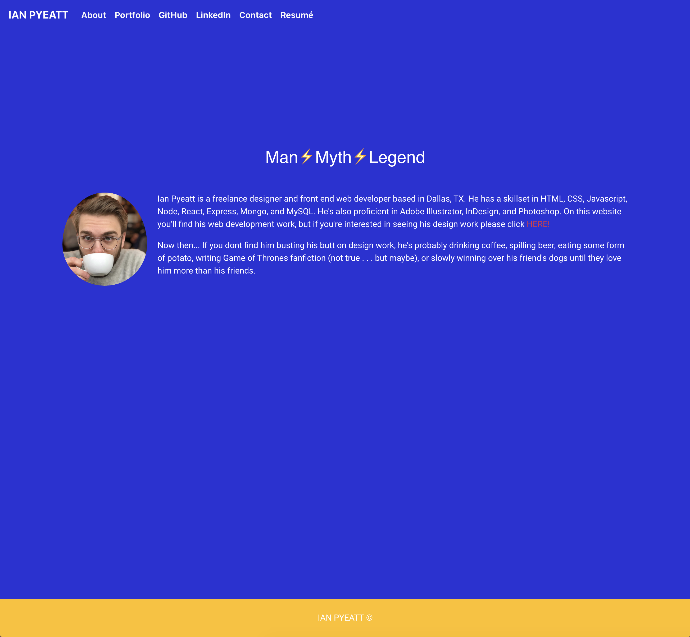

# React Portfolio

## Description

This project takes our Bootstrap Portfolio and impliments react.

## Technologies

react, bootstrap

## Projects

- Celebrity Horoscope / With this app we are creating an input field for the user to search the name of their favorite actor. Upon searching for their favorite actor the app will provide general information about them (birthdate, where they were born, movies they've been in), as well as their zodiac sign and a horoscope based on when they were born.
- Film Club / Film Club is an app with the goal to facilitate people's passion for movies and shows! Users are able to log their reviews of movies and shows, search other user's pages, and search all reviews of a particular movie or show they are interested in.
- Copy Slider / An exercise in using jquery to create sliding text revealer.
- Furneaux's / A front end design tutorial page for a Floral Design Site.
- Password Generator / The assignment was to create a password generator that first prompted the user to select how many characters they'd like to be in their password, followed by a series of confirms that asked what kind of characters (lower case letters, uppercase letter, numbers, or special characters).
- Budget App / With this simple app the user will be able to input money received or various expenses going out to keep track of their budget. The app uses indexedDB which allows the user to input stuff offline, and once reconnected with the internet, their info will be stored in the db.
- Fitness Tracker / With this app the user will be able to track two different types of workouts (resistance / cardio). They will be able to input specific information about each type of workout ex: Bench Press, 175lbs, 5 sets, 10 reps, 10 mins. The information will be stored in a database and pushed to a graph on their dashboard.
- Burger Logger / This app is a simple way to log the different types of burgers the users have had or want to try. You have the ability to create, update, delete burgers.

## Deployed

https://pyeatti.github.io/React-Portfolio/

## Screengrab

